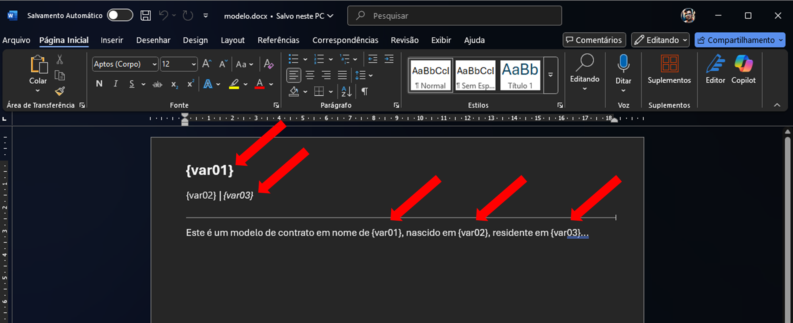
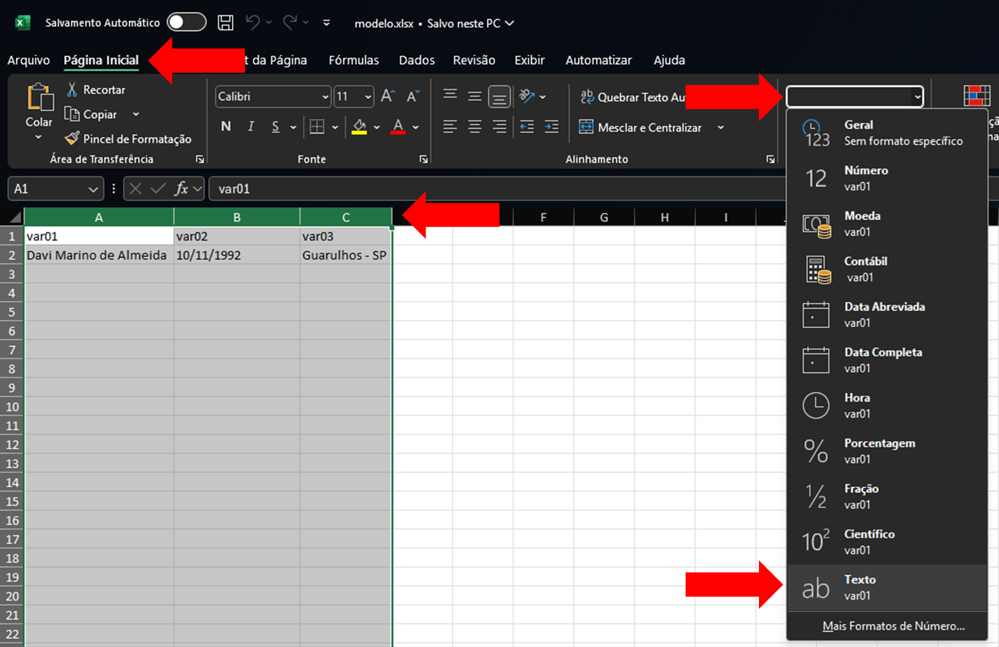
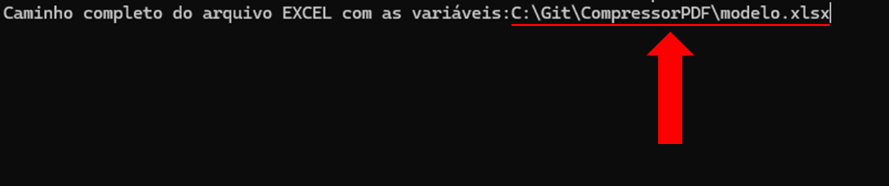
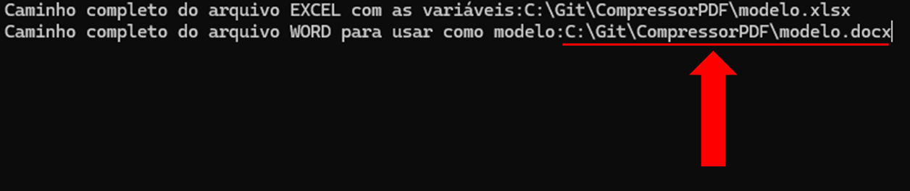
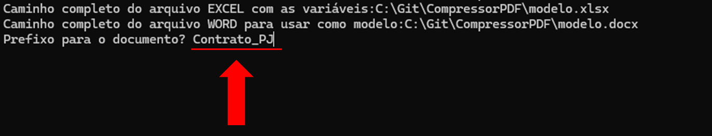
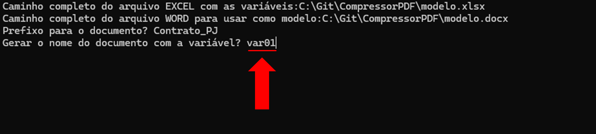
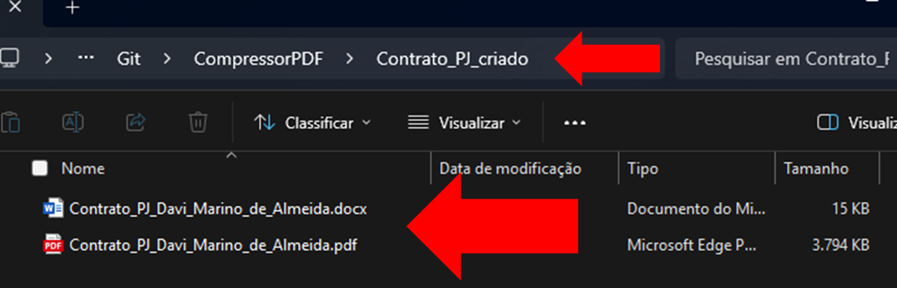
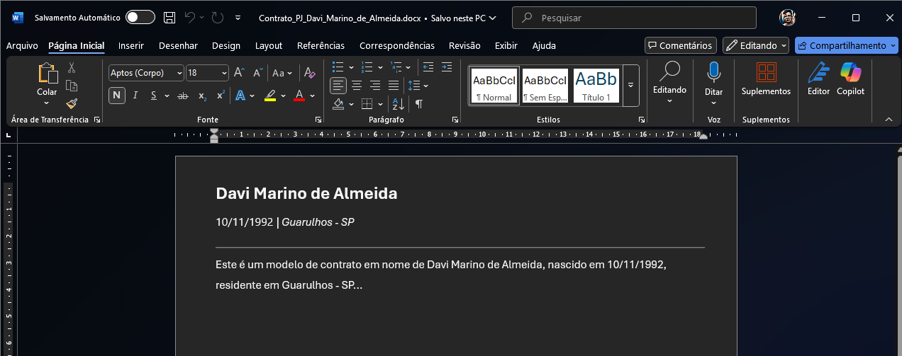
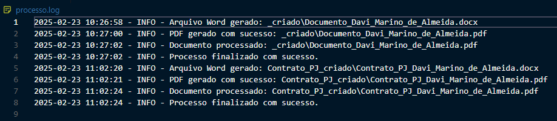

# 📄 Documentação - Geração de PDFs a partir de um Modelo Word

## 1. Introdução
Este sistema permite gerar múltiplos documentos **Word e PDF automaticamente** a partir de um modelo Word (`.docx`), substituindo variáveis dentro do documento e convertendo-o para PDF.

## 2. Requisitos
- O sistema já vem com tudo embutido em um executável.
- Microsoft Word instalado (necessário para conversão para PDF).
- Microsoft Excel instalado (necessário para as variáveis).
- Os arquivos Word e Excel precisam estar fechados para o programa poder trabalhar.

## 3. Como Usar

### Passo 1: Criar um Modelo Word
Crie um arquivo Word (`.docx`) para servir de modelo, depois substitua as palavras por variáveis nos locais que deseja substituir dinamicamente. Use o formato `{var01}, {var02}, {var03}`, etc.

**Exemplo:**

Neste exemplo estamos usando 3 variáveis que serão substituídas pelo nome do contratado, data de nascimento e cidade.

### Passo 2: Criar um Arquivo Excel
O Excel deve conter uma planilha onde cada coluna representa uma variável, e cada linha representa um conjunto de valores.

**Exemplo:**

⚠ **IMPORTANTE!** Os campos do Excel devem ser no formato texto idêntico ao exemplo.

### Passo 3: Executar o Programa
Abra o arquivo executável e forneça os caminhos necessários:

- Será aberto um terminal CMD com tela preta ou azul escuro.
- **Caminho do arquivo Excel** contendo os dados (`.xlsx`).
  - Aqui você passa o caminho completo do seu arquivo Excel, preste atenção para não escrever espaços, aspas, apóstrofos e caracteres extras.
  - 
- **Caminho do modelo Word**.
  - Aqui você passa o caminho completo do seu arquivo Word, preste atenção para não escrever espaços, aspas, apóstrofos e caracteres extras.
  - 
- **Prefixo para nome dos arquivos gerados.**
  - Aqui você passa o prefixo do nome do arquivo gerado, exemplo: `Contrato`.
  - Supondo que você esteja criando documentos para 20 pessoas, será criado assim: `Contrato_Nome da Pessoa.docx`.
  - 
- **Nome da variável para nomeação dos arquivos.**
  - Aqui você pode customizar o nome do arquivo criado, por padrão será usado `var01`, isso significa que no seu Excel a coluna `var01` vai ser o nome do arquivo Word criado.
  - Se no seu Excel a coluna `var01` for o nome da pessoa, será criado um documento Word como `Contrato_Nome da Pessoa.docx` ou se a coluna `var01` for o CPF da pessoa, será criado um documento Word como `Contrato_123.456.789-01.docx`.
  - 

**O resultado deve ser algo parecido com isto:**

- O executável vai fechar sozinho.
- Uma pasta será criada junto com o executável.
- O nome da pasta deve ser `{Prefixo}_criado`.
- As variáveis foram substituídas dinamicamente respeitando a formatação do seu modelo original.
- 
- 

## 4. Logs e Depuração
O sistema gera um log detalhado chamado `processo.log`. Se houver erros, consulte esse arquivo para entender o problema.

### Erro Comum: Microsoft Word não encontrado
> **Possível solução:** Certifique-se de que o Microsoft Word está instalado e acessível pelo sistema.

### Erro Comum: Arquivo de saída não gerado
> **Possível solução:** Verifique se os nomes das variáveis no Excel correspondem exatamente aos do modelo Word.

## 5. Resultado Esperado
Após a execução, os arquivos serão gerados dentro de uma pasta nomeada conforme o prefixo fornecido.
